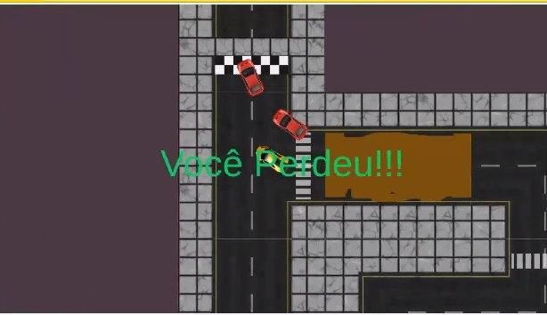

# [Grafos2_Poop Racer](https://projeto-de-algoritmos.github.io/Grafos2_PoopRacer/)

**Número da Lista**: 2<br>
**Conteúdo da Disciplina**: Grafos 2<br>

## Alunos

| Matrícula  | Aluno                       |
| ---------- | --------------------------- |
| 17/0010341 | Gabriel Davi Silva Pereira  |
| 17/0109208 | Luis Henrique Pereira Taira |

## Sobre

Poop racer consiste em uma corrida maluca onde você precisa chegar a linha de chegada, mas não será tão fácil, pois há caminhos que podem conter alguns imprevistos.

## Screenshots




## Instalação

**Linguagem**: Javascript<br>
**Framework**: Phaser<br>

### Para rodar localmente:

- Baixe ou clone este repositório
- Navegue até o diretório raiz do projeto e rode o comando:

```
$ python -m http.server 8080
```

ou use qualquer servidor http de sua preferência.

- Em um navegador (google chrome recomendado), vá para o endereço `localhost:8080`

## Uso

- Para jogar, clique na janela do jogo para que seu mouse seja capturado.
- Movimente-se com as teclas w,s para ir para frente e para trás, respectivamente.
- Oriente a direção de seu carro pelo mouse.
- Tente chegar até a linha de chegada.
